# Database design

This document describes the PostgreSQL schema for the MVP and the reasoning behind it. The schema itself is created by Alembic migrations (see `backend/`); this file is the design reference.

## Entity relationship diagram

```mermaid
erDiagram
    users {
        uuid id PK
        varchar email UK "stored lowercase"
        varchar password_hash
        varchar first_name
        varchar last_name
        char currency "ISO 4217, default EUR"
        varchar timezone "IANA name, default UTC"
        varchar language "default en"
        boolean is_active
        timestamptz email_verified_at "null = not verified"
        timestamptz created_at
        timestamptz updated_at
    }

    households {
        uuid id PK
        varchar name
        char currency "ISO 4217"
        timestamptz created_at
        timestamptz updated_at
    }

    household_members {
        uuid id PK
        uuid household_id FK
        uuid user_id FK
        varchar role "owner, admin, member, viewer"
        timestamptz joined_at
    }

    accounts {
        uuid id PK
        uuid owner_user_id FK "set = personal account"
        uuid household_id FK "set = shared account"
        varchar name
        varchar type "cash, bank, savings, credit_card, investment"
        char currency "ISO 4217"
        numeric opening_balance "NUMERIC(12,2)"
        text description
        timestamptz archived_at "null = active"
        timestamptz created_at
        timestamptz updated_at
    }

    categories {
        uuid id PK
        uuid owner_user_id FK "set = personal category"
        uuid household_id FK "set = household category"
        varchar name
        varchar kind "income, expense"
        varchar icon
        varchar color "#RRGGBB"
        timestamptz created_at
        timestamptz updated_at
    }

    transactions {
        uuid id PK
        uuid account_id FK "where the money moved"
        uuid household_id FK "null = private, set = visible to household"
        uuid category_id FK "null = uncategorized"
        uuid created_by_user_id FK "Added by ..."
        varchar type "income, expense, transfer_in, transfer_out"
        numeric amount "NUMERIC(12,2), always > 0"
        date occurred_on "financial date"
        varchar description
        text notes
        uuid transfer_group_id "links the two legs of a transfer"
        varchar split_method "equal, percentage, custom"
        timestamptz created_at
        timestamptz updated_at
    }

    transaction_splits {
        uuid id PK
        uuid transaction_id FK
        uuid user_id FK "member who owes this share"
        numeric amount "NUMERIC(12,2), > 0"
        timestamptz created_at
    }

    budgets {
        uuid id PK
        uuid owner_user_id FK "set = personal budget"
        uuid household_id FK "set = household budget"
        uuid category_id FK
        numeric amount "NUMERIC(12,2) per month"
        char currency "ISO 4217"
        smallint alert_threshold_pct "default 80"
        timestamptz created_at
        timestamptz updated_at
    }

    settlements {
        uuid id PK
        uuid household_id FK
        uuid from_user_id FK "who paid back"
        uuid to_user_id FK "who received"
        numeric amount "NUMERIC(12,2), > 0"
        char currency "ISO 4217"
        date settled_on
        varchar note
        uuid created_by_user_id FK
        timestamptz created_at
    }

    invitations {
        uuid id PK
        uuid household_id FK
        varchar email "invitee, stored lowercase"
        varchar role "admin, member, viewer"
        varchar token_hash UK "hash only, never the raw token"
        varchar status "pending, accepted, declined, revoked, expired"
        uuid invited_by_user_id FK
        timestamptz expires_at
        timestamptz responded_at
        timestamptz created_at
    }

    audit_logs {
        uuid id PK
        uuid household_id FK "null = personal or system event"
        uuid actor_user_id FK "null if the user was deleted"
        varchar action "e.g. transaction.created"
        varchar entity_type "e.g. transaction"
        uuid entity_id "no FK on purpose"
        jsonb details "before / after values"
        timestamptz created_at
    }

    users ||--o{ household_members : "belongs to"
    households ||--|{ household_members : "has"
    users |o--o{ accounts : "owns (personal)"
    households |o--o{ accounts : "owns (shared)"
    users |o--o{ categories : "owns"
    households |o--o{ categories : "owns"
    accounts ||--o{ transactions : "contains"
    categories |o--o{ transactions : "classifies"
    users |o--o{ transactions : "created by"
    households |o--o{ transactions : "visible to"
    transactions ||--o{ transaction_splits : "split into"
    users ||--o{ transaction_splits : "owes share"
    users |o--o{ budgets : "owns"
    households |o--o{ budgets : "owns"
    categories ||--o{ budgets : "limits"
    households ||--o{ settlements : "records"
    users ||--o{ settlements : "pays"
    users ||--o{ settlements : "receives"
    households ||--o{ invitations : "sends"
    users |o--o{ invitations : "invited by"
    households |o--o{ audit_logs : "history of"
    users |o--o{ audit_logs : "acted"
```

## How personal accounts stay personal

Privacy is enforced in four layers, from the database up.

**1. Every account has exactly one owner (database constraint).**
An account has two nullable foreign keys, `owner_user_id` and `household_id`, and a check constraint `num_nonnulls(owner_user_id, household_id) = 1`. An account is either personal or shared, never both and never neither. There is no "shared with user X" table, so there is simply no data structure through which a personal account could be exposed to another person.

The same pattern is used for `categories` and `budgets`. Using two real foreign keys (instead of a generic `owner_type` + `owner_id` pair) keeps referential integrity: the database rejects an owner that does not exist.

**2. One visibility rule, defined once (repository layer).**

- A user can see an **account** if they own it, or it belongs to a household they are a member of.
- A user can see a **transaction** if they can see its account, or its `household_id` is a household they are a member of.

Every repository query for accounts and transactions is built from this rule. There is no "get by id" without the current user. A resource that exists but belongs to someone else returns **404, not 403**, so the API does not even confirm that it exists.

**3. Sharing is explicit, per transaction, and opt-in.**
When Maria pays for a household dinner with her personal card, she records it on her personal account and marks it as shared with the household (`household_id` is set). Ivan then sees that one transaction: amount, date, description, category, and "paid by Maria". He never sees the account name, its balance, or any of Maria's other transactions. Household API responses do not include personal account details.

**4. Roles only grant power over shared data.**
Household roles (owner, admin, member, viewer) control what a member may do with *shared* accounts, budgets, and categories. Even the household owner cannot read another member's personal accounts. Permissions are checked in the service layer on every request, not in the frontend.

Example:

| Data | Maria sees | Ivan sees |
|---|---|---|
| Maria's "Personal Savings" (personal account) | yes | no (404) |
| Maria's private coffee on her personal card | yes | no |
| Maria's dinner on her personal card, shared with the household | yes | yes, without account details |
| "Family Account" (household account) and its transactions | yes | yes |

Automated tests for exactly these cases ("Ivan cannot see Maria's personal data") are part of the accounts and households milestones. PostgreSQL Row-Level Security could be added later as a second line of defense.

## Key design decisions

**Amounts are always positive; the direction comes from `type`.**
`amount` is `NUMERIC(12,2)` with `CHECK (amount > 0)`. `income` and `transfer_in` add money to the account; `expense` and `transfer_out` subtract it. Positive amounts are easier to validate and display, and a negative expense can never sneak in by mistake.

**A transfer is two rows.**
Moving money from Maria's personal account to the Family Account creates a `transfer_out` row on the personal account and a `transfer_in` row on the Family Account, linked by the same `transfer_group_id`. Each row follows the visibility of its own account, so Ivan sees "money in" on the Family Account without seeing Maria's personal account. The API still shows a single "Transfer" to the user.

**Balance is calculated, not stored.**
`current balance = opening_balance + incoming - outgoing`. A stored balance column can drift out of sync with the transactions (a bug, a failed update); a calculated one is always correct. With an index on `account_id` this is fast at MVP scale. A cached balance can be added later if needed.

**Who paid is derived, not stored.**
For a shared expense on a personal account, the payer is the account owner. For an expense on a household account, the household paid, so nobody owes anyone. Not storing a separate `paid_by` column removes a whole class of inconsistent data.

**Splits store final amounts.**
`transaction_splits` stores each member's share as an amount. `split_method` on the transaction remembers how it was calculated (equal, percentage, custom) so the UI can show and edit it, but the amounts are the source of truth. Rounding (for example 100 / 3) is resolved once, in the service layer, when the split is saved.

**Settlements are their own table.**
"Who owes whom" is calculated from shared transactions and their splits, minus recorded settlements. A settlement ("Ivan paid Maria back €100") is a payment between two members, not a purchase, so it does not belong in `transactions`.

**Dates: `DATE` for financial dates, `TIMESTAMPTZ` for events.**
`occurred_on` is a calendar date: a purchase on 31 March must stay in March regardless of time zones. `created_at` and similar columns are `TIMESTAMPTZ` (stored in UTC) because they record exact moments.

**Default categories are copied, not shared.**
When a user registers (or a household is created), the default categories (Food, Transport, Bills, ...) are created for them. Each user or household can then rename or delete them freely, and permission checks stay simple: every category has exactly one owner.

**Enums are `VARCHAR` + `CHECK`, not native PostgreSQL enums.**
Native enums are hard to change in migrations (removing or renaming a value requires recreating the type). A check constraint gives the same protection and is a one-line migration to change.

**Invitations store a hash of the token.**
The invitation link contains a random token; the database only stores its hash, the same principle as passwords. A leaked database backup cannot be used to join households.

**Audit logs are append-only and survive deletions.**
`entity_id` has no foreign key on purpose: the log must keep "Ivan deleted transaction X" even after X is gone. `details` is `JSONB`, so each action can record its own before/after values without schema changes.

**Money and currency (MVP).**
A transaction is always in its account's currency. Transfers are only allowed between accounts in the same currency. A budget counts only transactions in its own currency, and settlements are calculated per currency. Exchange rates are out of MVP scope.

## Constraints

Rules the database enforces:

| Table | Constraint |
|---|---|
| `users` | Unique `email` (stored lowercase) |
| `household_members` | Unique `(household_id, user_id)`; exactly one owner per household (partial unique index on `household_id` where `role = 'owner'`) |
| `accounts`, `categories`, `budgets` | `num_nonnulls(owner_user_id, household_id) = 1` |
| `categories` | Unique name per owner and kind |
| `budgets` | One budget per owner and category; `alert_threshold_pct` between 1 and 100 |
| `transactions` | `amount > 0`; `transfer_group_id` is set if and only if `type` is `transfer_in` or `transfer_out`; unique `(transfer_group_id, type)` |
| `transaction_splits` | `amount > 0`; unique `(transaction_id, user_id)` |
| `settlements` | `amount > 0`; `from_user_id <> to_user_id` |
| `invitations` | `role <> 'owner'`; unique `token_hash`; one pending invitation per household and email |

Rules the service layer enforces (they span several rows or tables, which a `CHECK` cannot express):

- A transaction on a household account always has `household_id` equal to the account's household.
- A transaction on a personal account can only be shared with a household the owner is a member of.
- A transaction's category, and a budget's category, belong to the same owner context (the user, or the household).
- Splits exist only on shared expenses paid from a personal account; every split user is a household member; splits add up to the transaction amount.
- Both legs of a transfer have the same amount, date, and currency.

## Delete behavior

| Foreign key | On delete | Why |
|---|---|---|
| `household_members` → users, households | CASCADE | A membership means nothing without both sides |
| `accounts`, `categories`, `budgets` → owner (user or household) | CASCADE | Deleting a user or household removes their data (GDPR "right to erasure") |
| `transactions.account_id` | CASCADE | In normal use accounts are archived (`archived_at`), not deleted; hard delete happens only when the owner is deleted |
| `transactions.category_id` | SET NULL | Deleting a category keeps the history as "Uncategorized" |
| `transactions.created_by_user_id` | SET NULL | Shared history survives when a member deletes their account ("Deleted user") |
| `transactions.household_id` | SET NULL | If a household is deleted, shared personal expenses become private again |
| `transaction_splits.transaction_id` | CASCADE | Splits are part of their transaction |
| `transaction_splits.user_id`, `settlements` → users | RESTRICT | Debts must be settled before a member can leave or be deleted |
| `budgets.category_id` | CASCADE | A budget for a deleted category is meaningless |
| `invitations.household_id`, `audit_logs.household_id` | CASCADE | Belong to the household |
| `invitations.invited_by_user_id`, `audit_logs.actor_user_id` | SET NULL | Keep the record, forget the person |

## Indexes

PostgreSQL does not index foreign keys automatically. Besides primary keys and unique constraints, the main indexes are:

| Index | Used for |
|---|---|
| `household_members (user_id)` | "Which households am I in?", part of every visibility check |
| `accounts (owner_user_id)`, `accounts (household_id)` | Listing a user's or household's accounts |
| `transactions (account_id, occurred_on DESC)` | Account statement with pagination, balance calculation |
| `transactions (household_id, occurred_on DESC)` | Household activity feed |
| `transactions (category_id, occurred_on)` | Budget "spent this month" |
| `transaction_splits (user_id)` | "Who owes whom" |
| `audit_logs (household_id, created_at DESC)` | Household audit history |

## Not in the MVP

From the full specification, these tables are planned for later: `attachments`, `recurring_transactions`, `subscriptions`, `financial_goals`, `notifications`, `budget_categories`, and exchange rates. Authentication tables (refresh tokens, email verification and password reset tokens) are added in Milestone 2.
